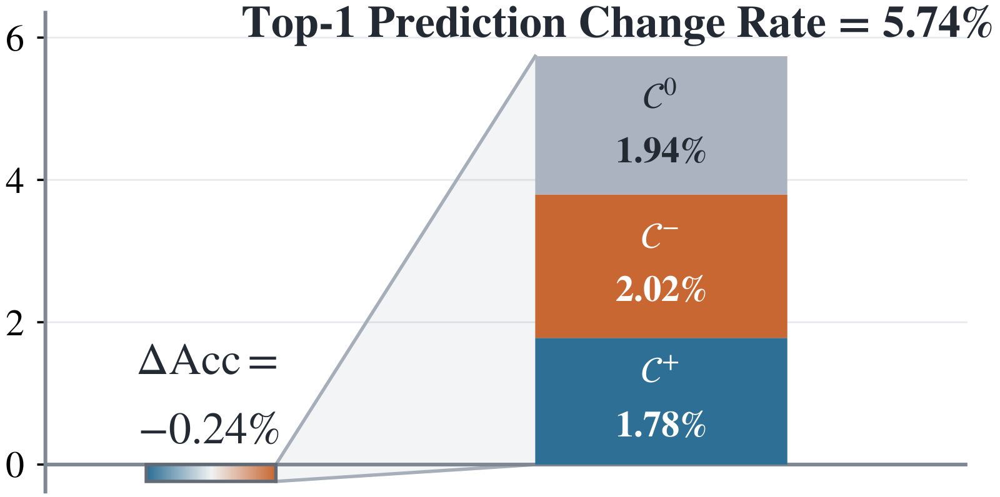

<h1 align="center">
  Let Confidence Change, Not the Prediction:<br>
  Prediction-Preserving Repair for Post-hoc Calibration
</h1>

<p align="center">
  <a href="https://scholar.google.com/citations?user=kqOWf4MAAAAJ"><strong>Daehwan Kim</strong></a>
  &nbsp;&middot;&nbsp;
  <a href="https://scholar.google.com/citations?user=O-oZnIwAAAAJ"><strong>Haejun Chung</strong></a><sup>&dagger;</sup>
  &nbsp;&middot;&nbsp;
  <a href="https://scholar.google.com/citations?user=1rBh9xkAAAAJ"><strong>Ikbeom Jang</strong></a><sup>&dagger;</sup>
  <br>
  <sub><sup>&dagger;</sup> Corresponding authors</sub>
</p>

<p align="center">
  📄 Paper (arXiv): <a href="https://arxiv.org/abs/2609.01072">https://arxiv.org/abs/2609.01072</a>
</p>

## Abstract

Post-hoc calibration corrects reported confidence, yet a multiclass calibrator can also change the associated top-1 prediction. Accuracy captures only the net effect of these changes on correctness, not how often predictions change; the Top-1 Prediction Change Rate (TPCR) instead measures this frequency. We propose Calibrator-Output Repair for Top-1 Decision Preservation (CORD), the first post-fit adapter to impose exact prediction preservation by repairing the full calibrated probability vector. From the original and calibrated outputs alone, CORD determines the mass assigned to the original top-1. The calibrated conditional distribution allocates the remaining mass over the other classes, yielding a repaired vector whose own argmax recovers the original prediction. On the calibration split, CORD coordinates the repaired masses to retain the calibrated outputs' mean mass on original predictions whenever attainable. The adapter alters neither the fitted calibrator nor its direct output, fits no additional supervised map, and requires no user- or validation-tuned hyperparameter. Across CIFAR-10/100 and ImageNet-1K, CORD attains zero TPCR by construction and lowers mean ECE, NLL, and Brier relative to the corresponding direct outputs in every dataset; paired gains persist under distribution shift and across calibration-set sizes. CORD thus removes the preservation constraint from calibrator fitting and assigns exact recovery of the original decision to subsequent output repair.

## Evaluating Prediction Preservation

Calibration quality and prediction preservation answer different questions: ECE, NLL, and Brier assess probability-report quality, whereas TPCR measures how often an evaluated report changes the original top-1 decision. Whenever a calibration map can change the argmax, TPCR should be reported alongside calibration metrics because accuracy captures only the net effect of those revisions on correctness.

<p align="center">
  
  <br>
  <sub><strong>Figure 1:</strong> Accuracy hides the extent of top-1 prediction changes. Results for Vector Scaling on ImageNet-1K with ResNet-50.</sub>
</p>

For $N$ evaluation examples, let $d_0$ denote the original top-1 rule and $d_1$ the rule induced by the evaluated probability report. Under the same fixed tie rule,

$$
\begin{aligned}
\Delta\mathrm{Acc}
&:=\mathrm{Acc}(d_1)-\mathrm{Acc}(d_0)
=\frac{|\mathcal C^+|-|\mathcal C^-|}{N},\\
\mathrm{TPCR}
&=\frac{1}{N}\sum_{i=1}^{N}
\mathbf{1}\left\lbrace d_1(x_i)\neq d_0(x_i)\right\rbrace
=\frac{|\mathcal C^+|+|\mathcal C^-|+|\mathcal C^0|}{N}.
\end{aligned}
$$

Here, $\mathcal C^+$, $\mathcal C^-$, and $\mathcal C^0$ denote incorrect $\rightarrow$ correct, correct $\rightarrow$ incorrect, and incorrect $\rightarrow$ a different incorrect class, respectively. Thus, $\Delta\mathrm{Acc}$ can be small even when TPCR is large: $\mathcal C^+$ and $\mathcal C^-$ offset one another, while $\mathcal C^0$ is invisible to accuracy. This decomposition uses labels; TPCR itself does not.

```python
import numpy as np


def tpcr(original: np.ndarray, evaluated: np.ndarray) -> float:
    return float(np.mean(
        np.argmax(original, axis=1) != np.argmax(evaluated, axis=1)
    ))
```

Use `tpcr(p0, q)` for the direct calibrated output and `tpcr(p0, p_repaired)` for the CORD repair. The function returns a fraction in `[0, 1]`; multiply by `100` to report a percentage. For valid inputs, `tpcr(p0, p_repaired)` is zero by construction.

## CORD at a Glance

CORD is a post-fit adapter for a fitted multiclass calibration map. Given the original classifier output $\mathbf p^0$ and the corresponding direct calibrated output $\mathbf q$, it constructs a separate full probability vector $\widetilde{\mathbf p}$ whose own argmax recovers the original prediction, while leaving both the fitted calibrator and $\mathbf q$ unchanged.

```text
Construction (calibration split)
(p0_cal, q_cal)  --->  CORD.fit  --->  eta_

Application (new inputs)
(p0, q) + eta_   --->  CORD.transform  --->  p_repaired
                                              argmax(p_repaired) = argmax(p0)
```

Here, `q_cal` and `q` are direct outputs of the same fitted calibrator, and `eta_` is the implementation's stored value of the shared scalar $\eta^\star$.

For one input, let $a=\arg\max_j p_j^0$ and $b=q_a$. CORD inherits the calibrated conditional distribution over all classes other than $a$ and changes only how probability mass is split between the original prediction and the remaining classes:

$$
\alpha_a=0,
\qquad
\alpha_j=\frac{q_j}{1-b}\quad(j\neq a),
\qquad
\widetilde{\mathbf p}(s)=s\mathbf e_a+(1-s)\boldsymbol\alpha.
$$

Here, $\mathbf e_a$ is the standard basis vector for class $a$. CORD selects $s$ from its strictly prediction-preserving interval, making $a$ uniquely top-ranked. On the calibration split, it coordinates the repaired masses through a Bernoulli–KL objective so that their mean equals the direct outputs' mean mass on the original predictions when attainable, and the nearest attainable mean otherwise. The resulting application rule retains only $\eta^\star$ and holds it fixed for new output pairs.

For valid probability inputs, every repaired output is normalized, recovers the original top-1 class as its unique argmax, and preserves the calibrated conditional distribution over the remaining classes. The aggregate mean condition applies only to the calibration split used by `fit`; changes in ECE, NLL, and Brier are empirical rather than structural guarantees.

## Installation

```bash
git clone https://github.com/labhai/CORD.git
cd CORD
python -m pip install -r requirements.txt
```

The reference implementation is contained in a single module, `cord.py`, and its only runtime dependency is NumPy. No deep-learning framework is required.

## Usage

Fit the base calibrator using its own API first, then collect the original and direct full probability vectors on the calibration split. CORD itself receives no labels.

```python
from cord import CORD


# Calibration split: paired full probability arrays with shape (N_cal, K)
cord = CORD().fit(
    original=p0_cal,
    calibrated=q_cal,
)

# New inputs from the same classifier and fitted calibrator
p_repaired = cord.transform(
    original=p0,
    calibrated=q,
)
```

The direct output `q` remains available unchanged; `p_repaired` is the corresponding prediction-preserving report.

### Input and Output

| Call | Notation | Meaning | Shape |
|---|---|---|---:|
| `fit(original=..., calibrated=...)` | $\mathbf p^0_{\mathrm{cal}},\mathbf q_{\mathrm{cal}}$ | Paired original and direct calibrated probability reports on the calibration split | `(N_cal, K)` each |
| `transform(original=..., calibrated=...)` | $\mathbf p^0,\mathbf q$ | Paired reports for new inputs from the same classifier and fitted calibrator | `(N, K)` each |
| return value | $\widetilde{\mathbf p}$ | Repaired full probability reports | `(N, K)` |

`fit` returns the CORD instance and stores the shared scalar as `eta_`. Call `fit` before `transform`.

Each array must be a finite, non-negative, row-normalized, two-dimensional full probability matrix with $N>0$ and $K\geq2$. Each original/calibrated pair must have the same shape and identical sample and class ordering. Do not pass logits, scalar confidences, predicted labels, or class indices; retain the batch dimension `(1, K)` for one input.

CORD requires both the original and direct calibrated outputs at application time. These input conditions are assumed rather than validated. Re-run `fit` whenever the classifier, fitted calibrator, or calibration split changes.

Exact ties use the smallest maximizing class index. For boundary outputs containing exact zeros, method quantities are computed from the paper's order-preserving stabilized internal copies; the supplied arrays remain unchanged. In that case, the mean-mass and conditional-distribution statements above are exact with respect to the stabilized internal calibrated outputs.

## Citation

BibTeX will be added soon.

## 📬 Contact

For questions about the paper or code, please contact **Daehwan Kim**.

📧 [officialhwan@hanyang.ac.kr](mailto:officialhwan@hanyang.ac.kr)

## License

See [LICENSE](LICENSE).
